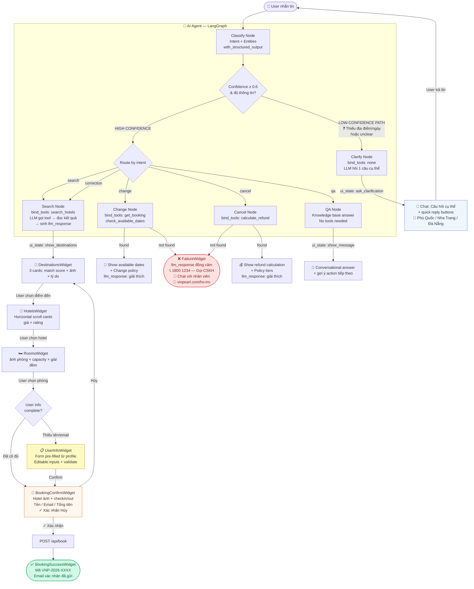

# User Flow — Đặt phòng qua AI Chatbot MyVinpearl

## Tổng quan

AI Agent xử lý ngôn ngữ tự nhiên → trích xuất intent + entities → routing thông minh → hiển thị rich UI cards ngay trong giao diện chat.

---

## Sơ đồ luồng (Mermaid)



---

## 4 Paths theo Spec

### 1. Happy Path ✅
```
User: "Tôi muốn đi Phú Quốc cuối tuần này 2 người"
  → Classify: intent=search, confidence=0.92
  → Search Node: LLM gọi search_hotels(destination="Phú Quốc", guest_count=2)
  → DestinationsWidget → HotelsWidget → RoomsWidget
  → UserInfoWidget (pre-fill: Nguyễn Mai Hồng Trâm / gmail.com)
  → BookingConfirmWidget (1 đêm, 2 người, tổng giá)
  → POST /api/book → VNP-2026-XXXX ✅
```

### 2. Low-confidence Path ❓
```
User: "Muốn đổi booking"
  → Classify: intent=change, confidence=0.55, clarification_needed=True
  → Clarify Node: "Bạn muốn đổi booking nào? Có mã VNP-... không?"
  → Quick replies: ["Tìm booking tự động", "Nhập mã booking"]
  
User: "VNP-2024-8821"
  → Classify: intent=change, confidence=0.95, booking_ref=VNP-2024-8821
  → Change Node → Available dates → Chọn ngày mới ✅
```

### 3. Failure Path ❌
```
User: "Hủy booking VNP-9999-8888"
  → Classify: intent=cancel, booking_ref=VNP-9999-8888
  → Cancel Node: get_booking_and_refund() → not found
  → LLM sinh câu trả lời đồng cảm
  → FailureWidget: "Không tìm thấy booking này..."
    [📞 Gọi 1800 1234] [💬 Chat nhân viên] [🔄 Thử mã khác]

User: "Chính sách hoàn tiền cho phòng ngày lễ là gì?"
  → Classify: intent=qa
  → QA Node: "Chính sách này chưa có trong dữ liệu hiện tại..."
  → FailureWidget (policy_not_found)
    [🔗 Xem đầy đủ tại vinpearl.com/chinh-sach]
```

### 4. Correction Path 🔄
```
User: "Tìm resort biển 2 người"
  → Search → DestinationsWidget (score cho 2 người)

User: "Không phải 2 người, là 4 người gia đình"
  → Classify: intent=correction, entities={guest_count:4, trip_type:family}
  → Search Node: merge {previous_entities + guest_count:4 + trip_type:family}
  → LLM: "Đã cập nhật! Với 4 người gia đình, đây là kết quả mới..."
  → DestinationsWidget (score mới, family-friendly cao hơn) ✅
```

---

## Cấu trúc Backend Agent

```
backend/agent/
  __init__.py      — public API: stream_agent_events, run_agent
  schemas.py       — AgentState, IntentResult (6 intents + clarification_needed)
  prompts.py       — CLASSIFY, SEARCH, CHANGE, CANCEL, QA, CLARIFY, FAILURE
  tools.py         — @tool: search_hotels, get_booking, calculate_refund, check_available_dates
  nodes.py         — classify, search (+ correction), change, cancel, qa, clarify, error
  graph.py         — LangGraph StateGraph
  stream.py        — SSE generator cho FastAPI
```

## Cấu trúc Frontend Chat (trong HTML)

```
Message types rendered in chat:
  'text'            → standard bubble
  'destinations'    → DestinationsWidget (3 cards + match score)
  'hotels'          → HotelsWidget (horizontal scroll)
  'rooms'           → RoomsWidget (vertical cards + images)
  'user_info'       → UserInfoWidget (pre-filled, editable, validates)
  'booking_confirm' → BookingConfirmWidget (full summary + confirm/cancel)
  'booking_success' → BookingSuccessWidget (green card + ref)
  'failure'         → FailureWidget (red card + CSKH escalation)
```
